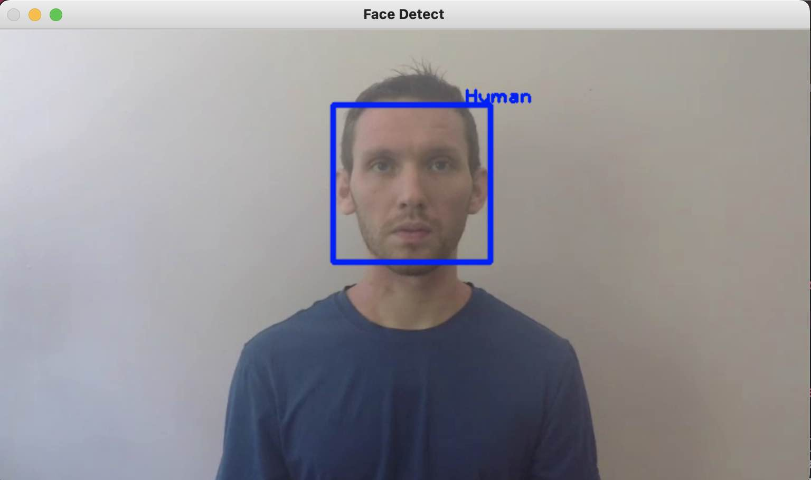

# ffmpeg-go

ffmpeg-go is golang port of https://github.com/kkroening/ffmpeg-python

check ffmpeg_test.go for examples.


# Examples

```go
split := Input(TestInputFile1).VFlip().Split()
	split0, split1 := split.Get("0"), split.Get("1")
	overlayFile := Input(TestOverlayFile).Crop(10, 10, 158, 112)
err := Concat([]*Stream{
    split0.Trim(KwArgs{"start_frame": 10, "end_frame": 20}),
    split1.Trim(KwArgs{"start_frame": 30, "end_frame": 40})}).
    Overlay(overlayFile.HFlip(), "").
    DrawBox(50, 50, 120, 120, "red", 5).
    Output(TestOutputFile1).
    OverWriteOutput().
    Run()
```

## Task Frame From Video

```bash
func ExampleReadFrameAsJpeg(inFileName string, frameNum int) io.Reader {
	buf := bytes.NewBuffer(nil)
	err := ffmpeg.Input(inFileName).
		Filter("select", ffmpeg.Args{fmt.Sprintf("gte(n,%d)", frameNum)}).
		Output("pipe:", ffmpeg.KwArgs{"vframes": 1, "format": "image2", "vcodec": "mjpeg"}).
		WithOutput(buf, os.Stdout).
		Run()
	if err != nil {
		panic(err)
	}
	return buf
}

reader := ExampleReadFrameAsJpeg("./sample_data/in1.mp4", 5)
img, err := imaging.Decode(reader)
if err != nil {
    t.Fatal(err)
}
err = imaging.Save(img, "./sample_data/out1.jpeg")
if err != nil {
    t.Fatal(err)
}
```
result : 


## Show Ffmpeg Progress

see complete example at: [showProgress](./examples/showProgress.go)

```bash
func ExampleShowProgress(inFileName, outFileName string) {
	a, err := ffmpeg.Probe(inFileName)
	if err != nil {
		panic(err)
	}
	totalDuration := gjson.Get(a, "format.duration").Float()

	err = ffmpeg.Input(inFileName).
		Output(outFileName, ffmpeg.KwArgs{"c:v": "libx264", "preset": "veryslow"}).
		GlobalArgs("-progress", "unix://"+TempSock(totalDuration)).
		OverWriteOutput().
		Run()
	if err != nil {
		panic(err)
	}
}
ExampleShowProgress("./sample_data/in1.mp4", "./sample_data/out2.mp4")
```

result 

```bash
progress:  .0
progress:  0.72
progress:  1.00
progress:  done
```

## Use Ffmpeg-go With Open-cv (gocv) For Face-detect

see complete example at: [opencv](./examples/opencv.go)

result: 

## Set cpu limit/request for ffmpeg-go

```go
e := ComplexFilterExample("./sample_data/in1.mp4", "./sample_data/overlay.png", "./sample_data/out2.mp4")
err := e.RunWithResource(0.1, 0.5)
if err != nil {
    assert.Nil(t, err)
}
```

result from command top: we will see ffmpeg used 0.5 core as expected.

```bash
> top 
PID    USER       PR  NI    VIRT    RES    SHR S  %CPU   %MEM     TIME+ COMMAND
1386105 root      20   0 2114152 273780  31672 R  50.2   1.7      0:16.79 ffmpeg
```

# View Graph

function view generate [mermaid](https://mermaid-js.github.io/mermaid/#/) chart, which can be use in markdown or view [online](https://mermaid-js.github.io/mermaid-live-editor/)

```go
split := Input(TestInputFile1).VFlip().Split()
	split0, split1 := split.Get("0"), split.Get("1")
	overlayFile := Input(TestOverlayFile).Crop(10, 10, 158, 112)
b, err := Concat([]*Stream{
    split0.Trim(KwArgs{"start_frame": 10, "end_frame": 20}),
    split1.Trim(KwArgs{"start_frame": 30, "end_frame": 40})}).
    Overlay(overlayFile.HFlip(), "").
    DrawBox(50, 50, 120, 120, "red", 5).
    Output(TestOutputFile1).
    OverWriteOutput().View(ViewTypeFlowChart)
fmt.Println(b)
```
